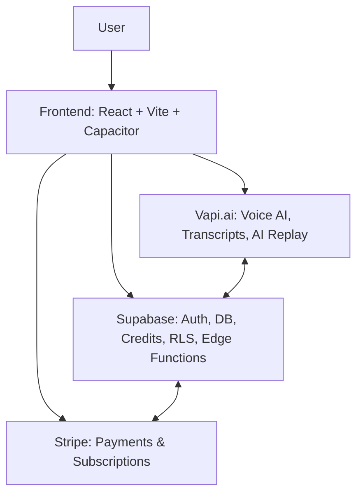
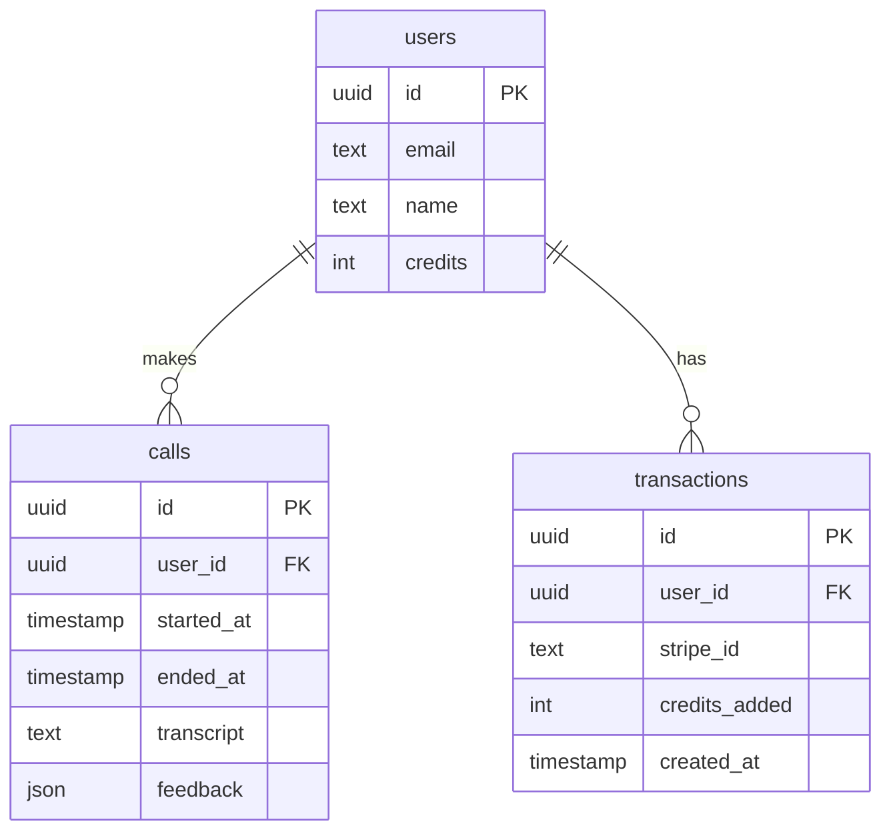

# Prospector – AI Cold Call Trainer

Prospector is a full-stack cross-platform application (Web, iOS, Android) that helps sales reps practice cold calls with an AI voice agent. This document provides all the context, architecture details, visuals, and setup instructions needed for any developer to start contributing immediately.

---

## What Prospector Does

```text
- Simulates live cold calls with an AI prospect (powered by Vapi.ai).
- Provides real-time transcripts of both sides of the conversation.
- Gives feedback and analysis after each call (tone, pacing, objections).
- Uses a credit system (purchased via Stripe) to limit usage.
- Works on Web, Android, and iOS with a shared codebase.
```


## System Architecture

##
```text
Frontend
- React + Vite + TypeScript
- Tailwind + shadcn/ui for UI
- Capacitor bridges web to Android/iOS builds

Backend
- Supabase for authentication, database, and edge functions
- Row-Level Security (RLS) enforced
- Edge functions handle transcripts, credits, and Stripe webhooks

Voice AI
- Vapi.ai powers real-time AI phone calls
- Streams audio both ways with transcript generation
- AI Replay allows playback of past calls

Payments
- Stripe manages subscriptions and credit purchases
- Stripe webhooks call Supabase edge functions to update user credits

Hosting
- Codebase lives in GitHub (main branch = source of truth)
- Web hosted on Vercel or Netlify
- Mobile builds via Android Studio and Xcode

```
### Database Schema

###
```text

- users → profile, email, credits balance
- calls → linked to user, stores transcripts + feedback
- transactions → records Stripe transactions + credit changes

```
### Repository Layout
```text
/src
  /components     → UI components (buttons, cards, inputs, etc.)
  /pages          → App pages (Dashboard, Call Screen, Login, etc.)
  /lib            → Helpers (API clients, utils)
  /hooks          → Custom React hooks (auth, realtime, AI chat)
  /styles         → Tailwind configs, global CSS
  /config         → Capacitor, Supabase, Stripe setup
/android          → Native Android project (generated by Capacitor)
/ios              → Native iOS project (generated by Capacitor)
/public           → Static assets (icons, logos)
/functions        → Supabase edge functions (credits, transcripts, payments)


```

# Getting Started (Local Development)
### 1. Clone & Install
```sh
1. Clone & Install
git clone https://github.com/Prospector-dev-1/prospector.git
cd prospector
npm install
```
### 2. Environment Variables
```sh
cp.env.example.env
```

```env
SUPABASE_URL=your-supabase-url
SUPABASE_ANON_KEY=your-supabase-anon-key
STRIPE_SECRET_KEY=your-stripe-secret
VAPI_KEY=your-vapi-api-key
```
### 3. Run Web Dev Server
```sh
npm run dev
```
```text
Runs at http://localhost:5173
```
### 4. Build for Web
```sh
npm run build
```

# Mobile Builds

## Android

```sh
npx cap sync android
```

```text
- Open /android in Android Studio
- Requirements:
  • minSdkVersion ≥ 24
  • minifyEnabled = false in debug builds
  • Microphone permission in AndroidManifest.xml
```
```sh
cd android
./gradlew assembleDebug
```
## IOS

```sh
npx cap sync ios

```
```text
- Open /ios in Xcode
- Add microphone usage description in Info.plist
- Build and run on simulator or device

```
# Development Workflow

```sh
# Create a feature branch
git checkout -b feature/new-feature

# Make changes & test locally

# Commit with clear message
git commit -m "feat: add new feature"

# Push and open PR
git push origin feature/new-feature

```
## Known issues
```text
- Transcript issues → sometimes duplicates or missing lines. Check TranscriptProcessor.ts
- Supabase warnings → RLS misconfigurations or insert errors. Review functions/ folder
- Android builds → Capacitor may generate duplicate MainActivity.java. Delete duplicates
- CORS/CSP → Supabase or Vapi websocket calls may fail unless proper CSP headers are set in index.html
- Build configs → colors.xml and Gradle variables must stay consistent across builds

```
## How to Extend the App
```text
- Add new UI pages → Create in /pages/ and link in router
- Add new Supabase functions → Write in /functions/ and deploy
- Add new payments logic → Extend Stripe webhook in /functions/
- Modify AI call flow → Update useRealtimeAIChat.ts and Vapi integration
```

## Project Goals (For Context)
```text
- Deliver a realistic AI cold call trainer
- Monetize via subscriptions and credits
- Ensure cross-platform parity (Web + iOS + Android)
- Keep transcripts accurate and synced in real time
- Onboard new developers quickly with one README as source of truth
```
## License
```
Proprietary – All rights reserved

```

### Note
```text
If you dont see Ios in the repo layout, thats normal,it is not intergrated yet.
If while debugging you find new issues, edit the README, and write the issues here ->

